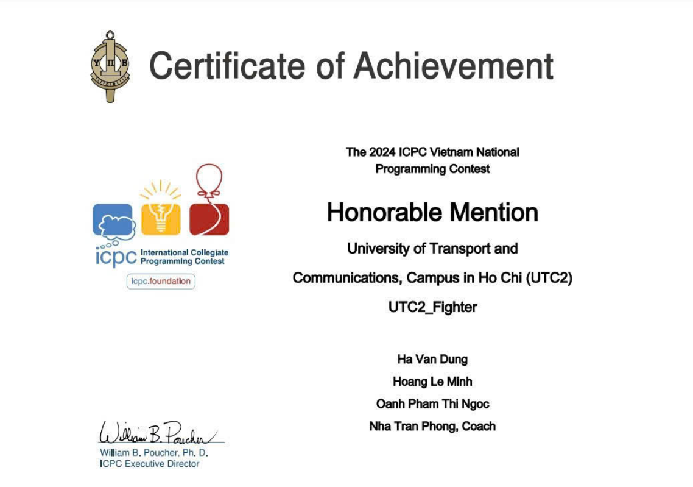

<h2 align="center">Hi 👋, I'm Dung Ken</h2>
<h3 align="center">A Passionate Developer from Vietnam 🇻🇳</h3>

## 🔹 About Me  
🚀 I’m currently learning **AI & Data Engineering**  
🎓 3rd-year student at **University of Transport and Communications, HCMC**  
💡 Passionate about **Software Development, Data, AI, and Cloud Computing**  
📌 Always eager to explore new technologies and best practices  

 

## 🚀 Tech Stack & Tools  
### 🖥️ Programming Languages  

  
  
  
  
  

### 🛠️ Frameworks & Libraries  

  
  
  
  
  

### 🗄️ Databases  

  
  
  
  

### ☁️ DevOps, Cloud & Deployment  

  
  
  
  
  

 

## 🏆 Certifications & Achievements  

<table align="center">
  <tr>
    <td align="center">
       
      <b>Third prize in scientific research 2023-2024</b>
    </td>
    <td align="center">
       
      <b>The 2024 ICPC VietNam National Programming Contest</b>
    </td>
  </tr>
</table>

 

## 📹 Video YouTube  
<table>
  <tr>
    <td align="center">
      
    </td>
    <td align="center">
      
    </td>
  </tr>
  <tr>
    <td align="center">
      
    </td>
    <td align="center">
      
    </td>
  </tr>
</table>

 

## 📊 GitHub Stats  

  
  

 

## 📫 How to Reach Me  

  
   
   
  
  

 

🚀 Let's <strong>collaborate </strong> and build something <strong> awesome </strong> together!  

